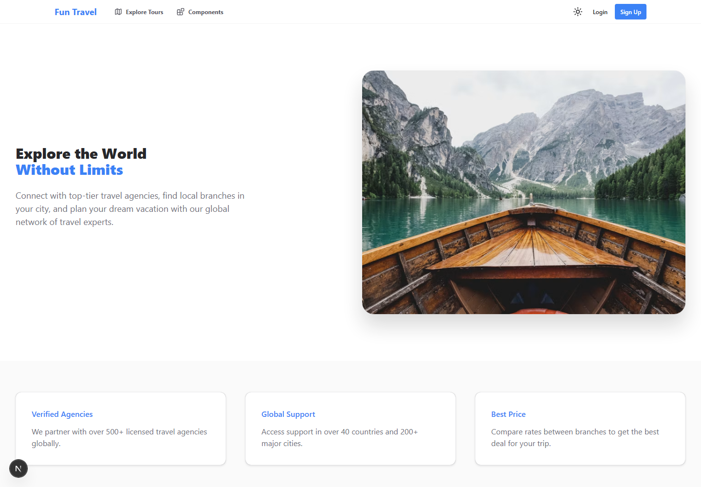
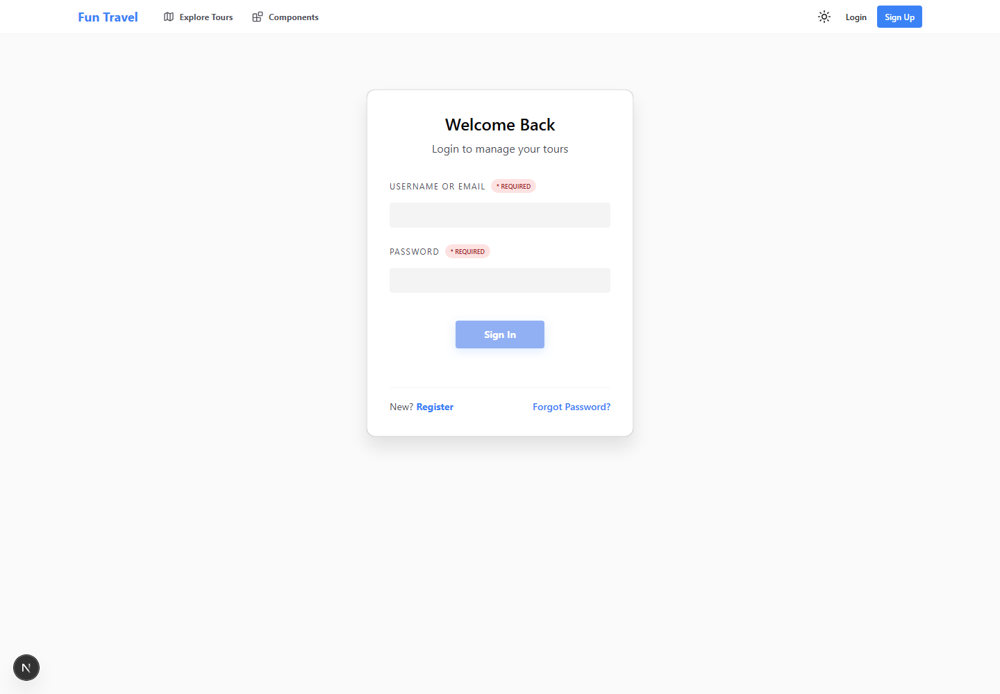
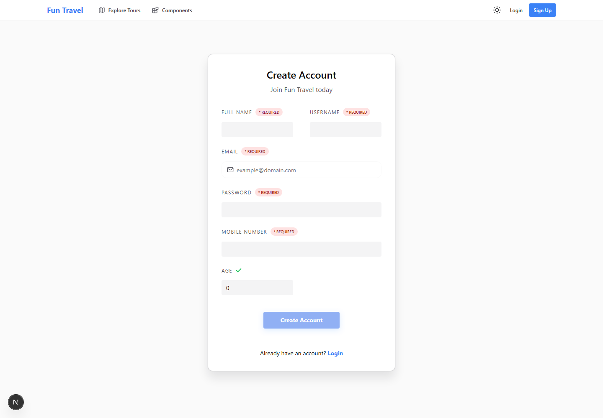
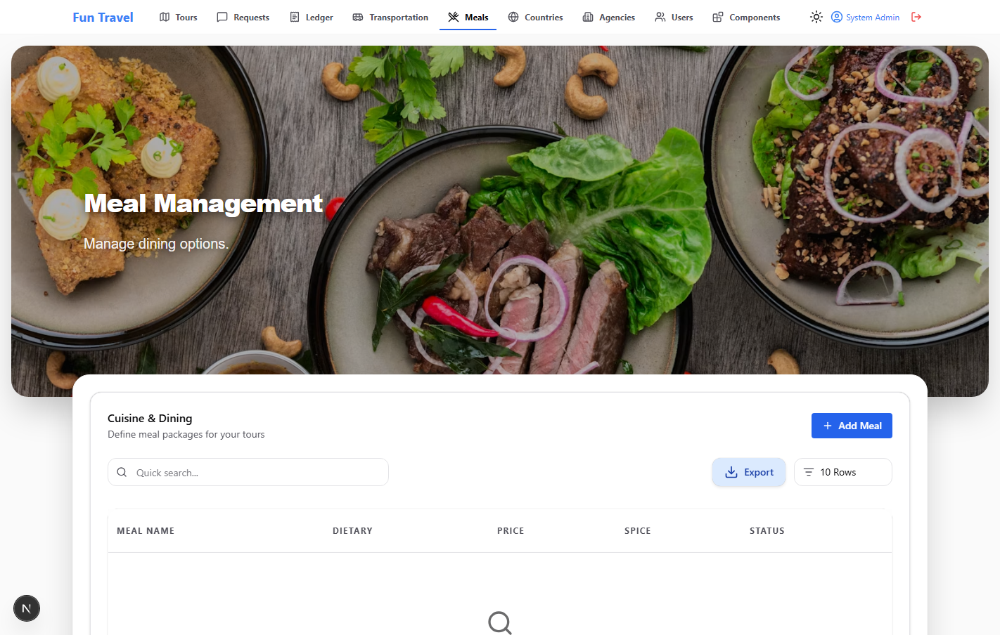
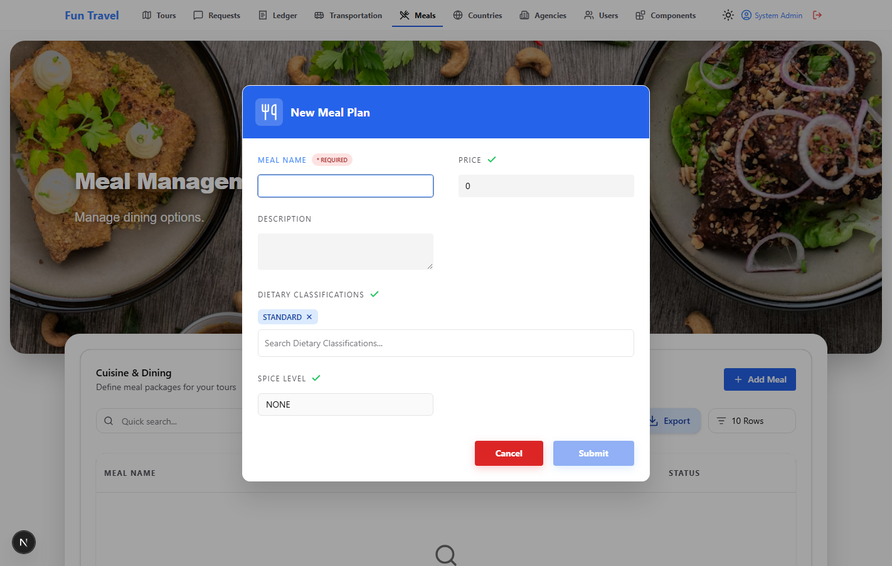
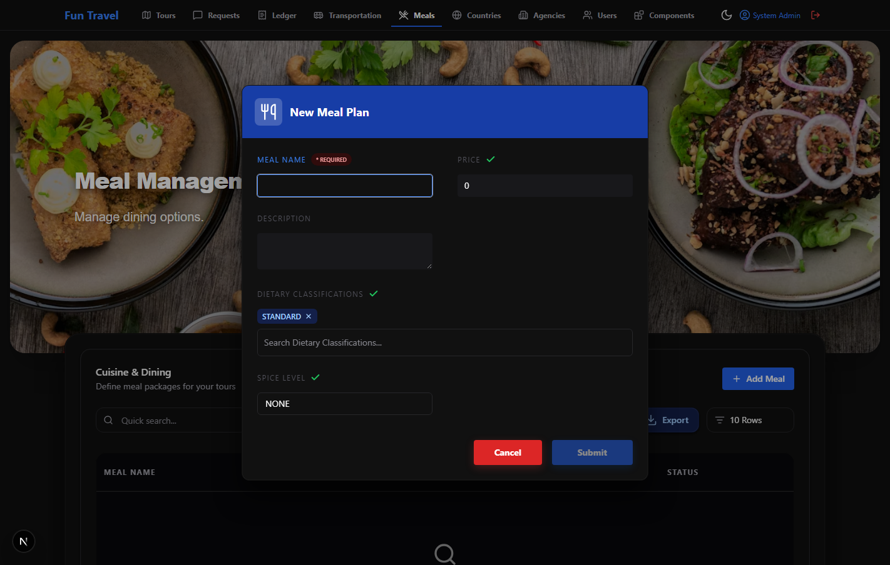

# Fun Travels Tour - Client

Web frontend for the Fun Travels Tour travel agency management platform.

**Author:** Hussain Al Aradi
**Tech:** React 19 | TypeScript | Next.js 16 | Chakra UI v3

## Application Screenshots

### Home



### Login



### Registration



### Booking Management


### Admin Meal Management

This view is captured after signing in with an administrator account and shows the admin navigation and meal-management actions.



### Admin Meal Plan Options

The meal form includes the meal name, price, description, dietary classifications, and spice level.



#### Admin Meal Plan Options in Dark Mode



## Quick Start

```bash
npm install
npm run dev
```

App starts at `http://localhost:3000`

## Documentation

Full documentation is in the separate repository: [fun-travels-tour-document](https://github.com/HussainALAradi5/fun-travels-tour-document)

## Tech Stack

| Technology | Version | Purpose |
|------------|---------|---------|
| React | 19.2.0 | UI Framework |
| TypeScript | 5.9.3 | Language |
| Next.js | 16.3.4 | Application Framework |
| Chakra UI | 3.30.0 | Component Library |
| Axios | 1.13.2 | HTTP Client |
| Next.js App Router | 16.3.4 | Routing |
| STOMP.js | 7.3.0 | WebSocket |
| Stripe | 8.11.0 | Payments |
| jsPDF | 4.1.0 | PDF Export |
| ExcelJS | 4.4.0 | Excel Export |

## Project Structure

```
src/
├── Api/              # API services (19 files)
├── components/       # UI components (90+ files)
├── config/           # Axios configuration
├── enums/            # TypeScript enums (17 files)
├── hooks/            # Custom hooks (11 files)
├── interface/        # TypeScript interfaces (18 files)
├── pages/            # Route pages (26 files)
└── utilities/        # Helpers and contexts
```
